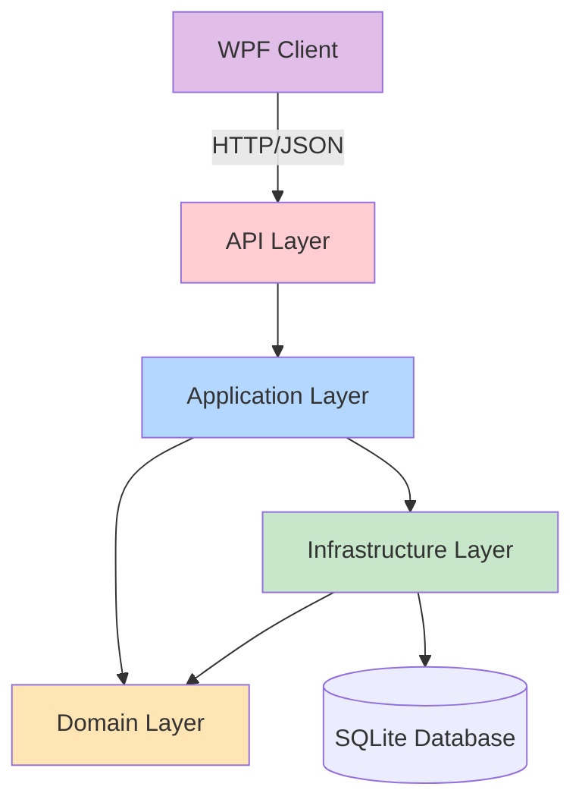
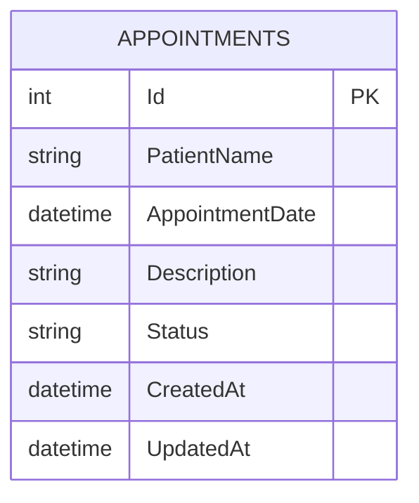

<div align="center">

# 📅 Appointment Management System

### Enterprise-grade scheduling system built with Clean Architecture, CQRS, and DDD

[](https://dotnet.microsoft.com/)
[](LICENSE)
[]()
[](CONTRIBUTING.md)

[Features](#-features) • [Architecture](#-architecture) • [Quick Start](#-quick-start) • [API Documentation](#-api-documentation) • [Tech Stack](#-tech-stack)

</div>

---

## 📋 Table of Contents

- [Overview](#overview)
- [Features](#-features)
- [Architecture](#-architecture)
- [Tech Stack](#-tech-stack)
- [Quick Start](#-quick-start)
- [Project Structure](#-project-structure)
- [API Documentation](#-api-documentation)
- [Business Rules](#-business-rules)
- [Design Patterns](#-design-patterns)
- [Screenshots](#-screenshots)
- [Production Considerations](#-production-considerations)
- [Testing Strategy](#-testing-strategy)
- [Contributing](#-contributing)
- [License](#-license)

## Overview

Production-ready appointment scheduling system showcasing **Clean Architecture** principles, **CQRS** pattern, **Domain-Driven Design**, and modern .NET development practices. Built as a reference implementation for enterprise applications requiring maintainability, testability, and scalability.

## ✨ Features

### Backend API
- ✅ **CQRS** implementation via MediatR for command/query separation
- ✅ **Domain-Driven Design** with rich domain models and invariant enforcement
- ✅ **Specification Pattern** for composable, reusable query logic
- ✅ **Result Pattern** for railway-oriented error handling
- ✅ **Global Exception Handling** with RFC 7807 ProblemDetails compliance
- ✅ **Structured Logging** using Serilog (console + file rotation)
- ✅ **API Versioning** with route-based versioning strategy
- ✅ **Rate Limiting** (100 requests/minute fixed window)
- ✅ **Health Checks** at `/health` endpoint
- ✅ **FluentValidation** with MediatR pipeline behaviors
- ✅ **Entity Framework Core** with SQLite (migration-ready for SQL Server/PostgreSQL)

### WPF Desktop Client
- ✅ **MVVM Pattern** with CommunityToolkit source generators
- ✅ **Server-Side Pagination** with configurable page sizes
- ✅ **Debounced Search** (300ms) for optimal API usage
- ✅ **Polly Retry Policies** with exponential backoff
- ✅ **Modern Dependency Injection** using Microsoft.Extensions.Hosting
- ✅ **Async/Await** throughout with CancellationToken support
- ✅ **CSV Export** functionality
- ✅ **Real-time Validation** with user-friendly error messages
- ✅ **Loading States** and error notifications

## 🏗️ Architecture



### Dependency Rules (Enforced)

| Layer | Dependencies | Responsibility |
|-------|--------------|----------------|
| **Domain** | None | Business entities, value objects, domain events, repository contracts |
| **Application** | Domain only | Use cases, CQRS handlers, validation, business workflows |
| **Infrastructure** | Domain + Application | Data access, EF Core, external services, repository implementations |
| **API** | All layers | Controllers, middleware, HTTP concerns, composition root |
| **WPF** | None (API client) | Presentation, MVVM, user interactions |

> **Key Principle**: Dependencies point inward. Domain has zero external dependencies.

## 🎯 Key Features

### Backend
- **CQRS** via MediatR for command/query separation
- **Domain-Driven Design** with rich domain models and business rule enforcement
- **Specification Pattern** for reusable query logic
- **Result Pattern** for railway-oriented programming
- **Global Exception Handler** with ProblemDetails RFC 7807 compliance
- **Structured Logging** with Serilog (console + file sinks)
- **API Versioning** with Microsoft.AspNetCore.Mvc.Versioning
- **Rate Limiting** (100 req/min fixed window)
- **Health Checks** at `/health` endpoint

### Frontend
- **MVVM** with source-generated observable properties and commands
- **Server-Side Pagination** with configurable page sizes
- **Debounced Search** (300ms delay) for optimal API usage
- **Polly Retry Policies** with exponential backoff
- **Modern DI** using Microsoft.Extensions.Hosting
- **Async/Await** throughout with proper cancellation token support
- **CSV Export** functionality

## 💻 Tech Stack

<table>
<tr>
<td>

### Backend


- **Framework**: .NET 7.0
- **Language**: C# 11 with nullable reference types
- **Database**: SQLite 7.0.14 (EF Core)
- **CQRS**: MediatR 12.1.1
- **Validation**: FluentValidation 11.8.0
- **Logging**: Serilog 7.0.0
- **API**: ASP.NET Core Web API

</td>
<td>

### Frontend


- **Framework**: WPF .NET 7.0
- **MVVM**: CommunityToolkit.Mvvm 8.3.2
- **HTTP**: HttpClient with Polly 8.2.0
- **DI**: Microsoft.Extensions.Hosting 7.0.1
- **Serialization**: Newtonsoft.Json 13.0.3
- **Export**: CsvHelper 30.0.1

</td>
</tr>
</table>

## 🚀 Quick Start

### Prerequisites

- [.NET 7.0 SDK](https://dotnet.microsoft.com/download/dotnet/7.0)
- [Visual Studio 2022](https://visualstudio.microsoft.com/) or [VS Code](https://code.visualstudio.com/)
- [Git](https://git-scm.com/)

### Installation

1. **Clone the repository**
   ```bash
   git clone https://github.com/yourusername/appointment-system.git
   cd appointment-system
   ```

2. **Install EF Core tools** (if not already installed)
   ```bash
   dotnet tool install --global dotnet-ef --version 7.0.14
   ```

3. **Setup database**
   ```bash
   # Create and apply migrations
   dotnet ef database update --project src/Infrastructure --startup-project src/API
   ```

4. **Trust development certificate**
   ```bash
   dotnet dev-certs https --trust
   ```

### Running the Application

#### Option 1: Run both applications separately

**Terminal 1 - API Server**
```bash
cd src/API
dotnet run
# API available at: https://localhost:7205
# Swagger UI: https://localhost:7205/swagger
```

**Terminal 2 - WPF Client**
```bash
cd src/WPF
dotnet run
```

#### Option 2: Visual Studio

1. Set **Multiple Startup Projects**:
   - Right-click Solution → Properties → Startup Project
   - Select "Multiple startup projects"
   - Set both `AppointmentSystem.API` and `AppointmentSystem.WPF` to "Start"

2. Press `F5` to run

### Verify Installation

1. **API Health Check**: Navigate to `https://localhost:7205/health`
   - Should return: `Healthy`

2. **Swagger UI**: Open `https://localhost:7205/swagger`
   - Test endpoints directly in browser

3. **WPF Client**: 
   - Create a test appointment
   - Verify it appears in the list
   - Check database: `src/API/appointments.db`

## 📁 Project Structure

```
AppointmentSystem/
├── 📄 AppointmentSystem.sln
└── src/
    ├── 🎯 Domain/                      # Enterprise Business Rules
    │   ├── Common/                     # Base entities, domain events
    │   ├── Entities/                   # Appointment (rich domain model)
    │   ├── Enums/                      # AppointmentStatus
    │   ├── Exceptions/                 # Domain-specific exceptions
    │   ├── Repositories/               # Repository contracts (interfaces)
    │   └── Specifications/             # Query specifications
    │
    ├── 💼 Application/                 # Application Business Rules
    │   ├── Appointments/
    │   │   ├── Commands/               # CreateAppointment, UpdateAppointment, Delete
    │   │   ├── Queries/                # GetAppointments, GetAppointmentById
    │   │   └── Common/                 # DTOs
    │   ├── Common/
    │   │   ├── Behaviors/              # ValidationBehavior (MediatR pipeline)
    │   │   └── Models/                 # Result<T>, PagedResult<T>
    │   └── DependencyInjection.cs
    │
    ├── 🗄️ Infrastructure/              # External Concerns
    │   ├── Persistence/
    │   │   ├── AppointmentDbContext.cs
    │   │   ├── Configurations/         # EF Core Fluent API configs
    │   │   └── Repositories/           # Repository implementations
    │   ├── Migrations/                 # EF Core migrations
    │   └── DependencyInjection.cs
    │
    ├── 🌐 API/                         # Presentation Layer (HTTP)
    │   ├── Controllers/
    │   │   └── V1/                     # AppointmentsController
    │   ├── Middleware/                 # Global exception handler, logging
    │   ├── Program.cs                  # Composition root
    │   ├── appsettings.json
    │   └── logs/                       # Serilog output
    │
    └── 🖥️ WPF/                         # Desktop Client
        ├── Models/                     # DTOs matching API contracts
        ├── Services/                   # API client with Polly
        ├── ViewModels/                 # MVVM ViewModels
        ├── Converters/                 # Value converters for XAML
        ├── App.xaml                    # DI configuration
        └── MainWindow.xaml             # Main UI

```

### Lines of Code
- **Domain**: ~400 LOC
- **Application**: ~800 LOC
- **Infrastructure**: ~500 LOC
- **API**: ~400 LOC
- **WPF**: ~900 LOC
- **Total**: ~3,000 LOC

## 📡 API Documentation

### Base URL
```
https://localhost:7205/api/v1
```

### Endpoints

#### Get Appointments (Paginated)
```http
GET /appointments?searchTerm={term}&pageNumber={n}&pageSize={size}
```

**Query Parameters:**
| Parameter | Type | Default | Description |
|-----------|------|---------|-------------|
| `searchTerm` | string | null | Filter by patient name |
| `pageNumber` | int | 1 | Current page (1-indexed) |
| `pageSize` | int | 20 | Items per page (1-100) |

**Response:** `200 OK`
```json
{
  "items": [
    {
      "id": 1,
      "patientName": "John Doe",
      "appointmentDate": "2026-02-15T10:00:00Z",
      "description": "Annual checkup",
      "status": "Scheduled",
      "createdAt": "2026-02-01T08:00:00Z",
      "updatedAt": "2026-02-01T08:00:00Z"
    }
  ],
  "pageNumber": 1,
  "pageSize": 20,
  "totalCount": 42,
  "totalPages": 3,
  "hasPreviousPage": false,
  "hasNextPage": true
}
```

#### Get Appointment by ID
```http
GET /appointments/{id}
```

**Response:** `200 OK` or `404 Not Found`

#### Create Appointment
```http
POST /appointments
Content-Type: application/json
```

**Request Body:**
```json
{
  "patientName": "Jane Smith",
  "appointmentDate": "2026-02-20T14:00:00Z",
  "description": "Follow-up consultation"
}
```

**Response:** `201 Created`
```json
{
  "id": 2,
  "patientName": "Jane Smith",
  "appointmentDate": "2026-02-20T14:00:00Z",
  "description": "Follow-up consultation",
  "status": "Scheduled",
  "createdAt": "2026-02-02T10:30:00Z",
  "updatedAt": "2026-02-02T10:30:00Z"
}
```

**Validation Errors:** `400 Bad Request`
```json
{
  "type": "https://tools.ietf.org/html/rfc7231#section-6.5.1",
  "title": "One or more validation errors occurred.",
  "status": 400,
  "errors": {
    "PatientName": ["Patient name is required"],
    "AppointmentDate": ["Appointments must be during business hours (8 AM - 5 PM)"]
  }
}
```

#### Update Appointment
```http
PUT /appointments/{id}
Content-Type: application/json
```

**Request Body:**
```json
{
  "patientName": "Jane Smith",
  "appointmentDate": "2026-02-20T15:00:00Z",
  "description": "Rescheduled consultation",
  "status": "Scheduled"
}
```

**Response:** `200 OK` or `404 Not Found`

#### Delete Appointment
```http
DELETE /appointments/{id}
```

**Response:** `204 No Content` or `404 Not Found`

#### Health Check
```http
GET /health
```

**Response:** `200 OK` - `Healthy`

### Response Headers
All API responses include:
```
X-Correlation-ID: {guid}  # For request tracing in logs
```

## 🎯 Business Rules

### Domain-Level Enforcement

| Rule | Constraint | Validation |
|------|-----------|------------|
| **Patient Name** | 1-200 characters, letters/spaces/hyphens only | `[A-Za-z\s'-]+` |
| **Appointment Date** | Future dates only, >5 minutes from now | Domain exception on violation |
| **Business Hours** | 8:00 AM - 5:00 PM only | FluentValidation |
| **Weekdays Only** | Monday - Friday | FluentValidation |
| **Description** | Optional, max 1000 characters | Domain validation |
| **Status Transitions** | Cannot cancel completed appointments | Domain logic |
| **Immutability** | Appointments use factory pattern | `private` constructors |

### Example: Domain Validation
```csharp
public static Appointment Create(string patientName, DateTime appointmentDate, string? description)
{
    var appointment = new Appointment();
    appointment.SetPatientName(patientName);      // Throws DomainException if invalid
    appointment.SetAppointmentDate(appointmentDate); // Validates business rules
    appointment._status = AppointmentStatus.Scheduled;
    return appointment;
}
```

## 🎨 Design Patterns

This implementation showcases multiple enterprise patterns:

| Pattern | Implementation | Purpose |
|---------|----------------|---------|
| 🏰 **Clean Architecture** | 5-layer separation | Dependency inversion, testability |
| ⚡ **CQRS** | MediatR handlers | Read/write separation, scalability |
| 🎯 **Domain-Driven Design** | Rich domain models | Business logic encapsulation |
| 📦 **Repository** | Generic repository | Data access abstraction |
| 🔄 **Unit of Work** | Transaction management | Atomic operations |
| 🔍 **Specification** | Reusable queries | Query composition |
| 🚂 **Result Pattern** | `Result<T>` | Railway-oriented programming |
| 🎭 **Mediator** | MediatR | Decoupled communication |
| 🛡️ **Pipeline Behavior** | Validation pipeline | Cross-cutting concerns |
| 🏭 **Factory** | Domain entity creation | Encapsulated construction |
| 👁️ **MVVM** | CommunityToolkit | UI separation |
| 🔄 **Retry Pattern** | Polly policies | Resilience |

## 📸 Screenshots

### API - Swagger Documentation

*Interactive API documentation with OpenAPI specification*

### WPF Client - Main Window

*Desktop application with pagination, search, and CRUD operations*

### Database - Entity Diagram


> **Note**: Add actual screenshots to `/docs/images/` directory

## ⚙️ Error Handling

Comprehensive error handling at every layer:

### Validation Errors (400)
```json
{
  "title": "One or more validation errors occurred.",
  "status": 400,
  "errors": {
    "AppointmentDate": ["Appointments cannot be scheduled on weekends"]
  }
}
```

### Domain Errors (400)
```json
{
  "title": "Business rule violation",
  "status": 400,
  "detail": "Cannot complete a cancelled appointment"
}
```

### Not Found (404)
```json
{
  "title": "Resource not found",
  "status": 404,
  "detail": "Appointment with ID 999 was not found"
}
```

### Server Errors (500)
```json
{
  "title": "Internal Server Error",
  "status": 500,
  "detail": "An error occurred while processing your request.",
  "instance": "/api/v1/appointments/123"
}
```

All errors include `X-Correlation-ID` header for log tracing.

## 🏭 Production Considerations

### ✅ Implemented
- [x] Structured logging with Serilog (console + file)
- [x] Global exception handling middleware
- [x] FluentValidation with MediatR pipeline
- [x] Rate limiting (100 req/min)
- [x] Health checks endpoint
- [x] CORS configuration
- [x] Polly retry policies (3 retries, exponential backoff)
- [x] Cancellation token propagation
- [x] API versioning
- [x] ProblemDetails RFC 7807 compliance
- [x] Request correlation IDs

### ⚠️ Not Implemented (Production TODO)
- [ ] **Authentication & Authorization** (IdentityServer4/JWT/OAuth2)
- [ ] **Database Migrations** in CI/CD pipeline
- [ ] **Distributed Caching** (Redis/Memcached)
- [ ] **Message Queue** for domain events (RabbitMQ/Azure Service Bus)
- [ ] **Background Jobs** (Hangfire/Quartz.NET)
- [ ] **API Gateway** if microservices architecture
- [ ] **Containerization** (Docker + Kubernetes)
- [ ] **Telemetry** (Application Insights/OpenTelemetry)
- [ ] **Circuit Breaker** (Polly advanced patterns)
- [ ] **API Throttling** per user/API key
- [ ] **Audit Logging** for compliance
- [ ] **Integration Tests** (WebApplicationFactory)
- [ ] **Load Testing** (K6/JMeter)

### 🔄 Database Migration Path

Currently using **SQLite** for development. For production:

**SQL Server:**
```bash
# Update connection string in appsettings.json
"DefaultConnection": "Server=.;Database=Appointments;Trusted_Connection=True;"

# Change Infrastructure/DependencyInjection.cs
options.UseSqlServer(connectionString);  // Instead of UseSqlite

# Recreate migrations
dotnet ef migrations remove
dotnet ef migrations add InitialCreate
dotnet ef database update
```

**PostgreSQL:**
```bash
# Install package
dotnet add package Npgsql.EntityFrameworkCore.PostgreSQL

# Update provider
options.UseNpgsql(connectionString);
```

All EF Core configurations are database-agnostic.

## 🧪 Testing Strategy

Not yet implemented, but architecture supports:

```
tests/
├── Domain.Tests/               # Pure unit tests, no mocking
│   └── Entities/
│       └── AppointmentTests.cs
│
├── Application.Tests/          # Handler tests with in-memory repos
│   └── Appointments/
│       └── Commands/
│           └── CreateAppointmentHandlerTests.cs
│
├── Infrastructure.Tests/       # Integration tests with SQLite in-memory
│   └── Repositories/
│       └── AppointmentRepositoryTests.cs
│
├── API.Tests/                  # Integration tests with WebApplicationFactory
│   └── Controllers/
│       └── AppointmentsControllerTests.cs
│
└── WPF.Tests/                  # ViewModel tests with mocked API
    └── ViewModels/
        └── MainViewModelTests.cs
```

### Recommended Testing Tools
- **xUnit** - Test framework
- **FluentAssertions** - Assertion library
- **Moq** - Mocking framework
- **AutoFixture** - Test data generation
- **WebApplicationFactory** - API integration tests
- **Testcontainers** - Database integration tests

## 🤝 Contributing

Contributions are welcome! Please follow these guidelines:

1. **Fork** the repository
2. **Create** a feature branch (`git checkout -b feature/amazing-feature`)
3. **Commit** your changes (`git commit -m 'Add amazing feature'`)
4. **Push** to the branch (`git push origin feature/amazing-feature`)
5. **Open** a Pull Request

### Code Style
- Follow C# coding conventions
- Use meaningful variable names
- Add XML documentation for public APIs
- Write unit tests for new features
- Keep methods small and focused

### Commit Messages
Follow [Conventional Commits](https://www.conventionalcommits.org/):
```
feat: add appointment reminder feature
fix: resolve pagination bug on edge cases
docs: update API documentation
test: add unit tests for domain entities
refactor: simplify command handler logic
```

## 📄 License

This project is licensed under the **MIT License** - see the [LICENSE](LICENSE) file for details.

```
MIT License

Copyright (c) 2026 [Your Name]

Permission is hereby granted, free of charge, to any person obtaining a copy
of this software and associated documentation files (the "Software"), to deal
in the Software without restriction, including without limitation the rights
to use, copy, modify, merge, publish, distribute, sublicense, and/or sell
copies of the Software, and to permit persons to whom the Software is
furnished to do so, subject to the following conditions:

The above copyright notice and this permission notice shall be included in all
copies or substantial portions of the Software.

THE SOFTWARE IS PROVIDED "AS IS", WITHOUT WARRANTY OF ANY KIND, EXPRESS OR
IMPLIED, INCLUDING BUT NOT LIMITED TO THE WARRANTIES OF MERCHANTABILITY,
FITNESS FOR A PARTICULAR PURPOSE AND NONINFRINGEMENT. IN NO EVENT SHALL THE
AUTHORS OR COPYRIGHT HOLDERS BE LIABLE FOR ANY CLAIM, DAMAGES OR OTHER
LIABILITY, WHETHER IN AN ACTION OF CONTRACT, TORT OR OTHERWISE, ARISING FROM,
OUT OF OR IN CONNECTION WITH THE SOFTWARE OR THE USE OR OTHER DEALINGS IN THE
SOFTWARE.
```

## 🙏 Acknowledgments

- **Clean Architecture** - Robert C. Martin
- **Domain-Driven Design** - Eric Evans
- **CQRS Pattern** - Greg Young
- **MediatR** - Jimmy Bogard
- **FluentValidation** - Jeremy Skinner
- **Polly** - App-vNext team
- **CommunityToolkit.Mvvm** - Microsoft .NET Community

## 📞 Contact

**Project Link**: [https://github.com/yourusername/appointment-system](https://github.com/yourusername/appointment-system)

**Issues**: [https://github.com/yourusername/appointment-system/issues](https://github.com/yourusername/appointment-system/issues)

---

<div align="center">

### ⭐ Star this repo if you find it useful!

**Built with** ❤️ **using Clean Architecture principles**

[Report Bug](https://github.com/yourusername/appointment-system/issues) · [Request Feature](https://github.com/yourusername/appointment-system/issues) · [Documentation](docs/)

</div>
